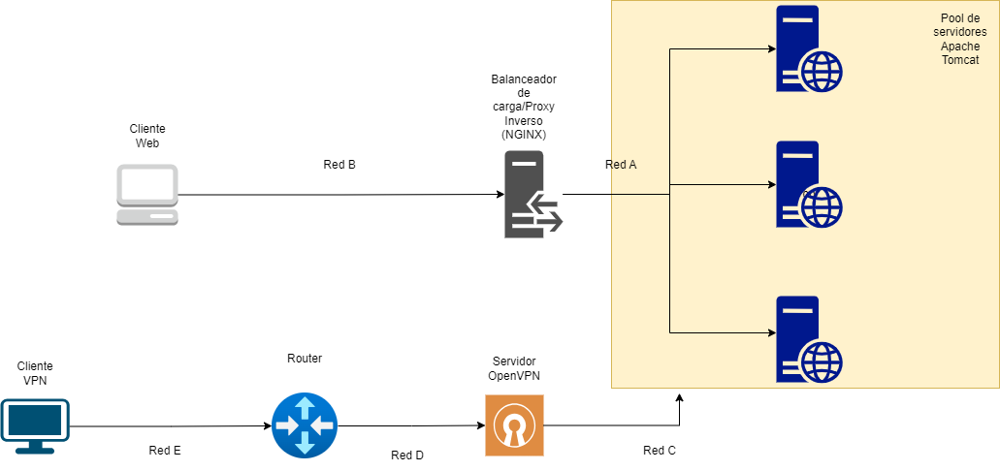

# Escenario completo de Seguridad
En la segunda parte del curso, nos encargamos de desarrollar un escenario donde un cliente solicita un recurso web (una aplicación de ejemplo). Esta solicitud es tomada por un proxy inverso (NGINX) y redirigida al recurso final (servidor web Tomcat). Al mismo tiempo, este proxy inverso funciona como balanceador de carga que distribuye las solicitudes hacia el pool de servidores. 

# Instrucciones
Para la convocatoria, vamos a agregar un servidor VPN que permita conectarse a un cliente a los servidores web. Los servidores deben estar conectados a dos redes: una que utiliza para comunicarse con el proxy, y otra que utiliza para administración con el servidor VPN. A continuación se muestra el escenario a completar:

Para completar la parte inferior del diagrama deberá hacer lo siguiente:
1. Instalar un servidor VPN (OpenVPN) utilizando [esta imagen](https://hub.docker.com/r/linuxserver/openvpn-as). El servidor VPN debe tener dos interfaces, una "pública" y una interna/privada (que debe compartir con los servidores web).
2. Instalar un router que permite simular que tanto el cliente como el servidor VPN estan en redes diferentes. Este item es libre como quieran hacerlo, pero puede utilizar `iptables` para llevar a cabo el enrutamiento. Como el contenedor que utilicen para enrutador tendrá dos interfaces entonces pueden utilizarlo para que haga un `forward`. Pueden utilizar la [documentación oficial](https://linux.die.net/man/8/iptables) de iptables y la tabla NAT del comando `iptables -t nat`.
3. Las redes a utilizar en el caso de la `D` y `E` en el diagrama pueden ser de la clase E [para fines de investigación](https://www.meridianoutpost.com/resources/articles/IP-classes.php). 

En resumen, para que el escenario funcione el cliente VPN debe establecer una conexión exitosa con el servidor VPN y luego poder conectarse a cualquiera de los servidores web por medio de SSH (utilizando llave pública).