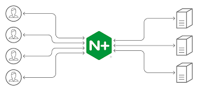
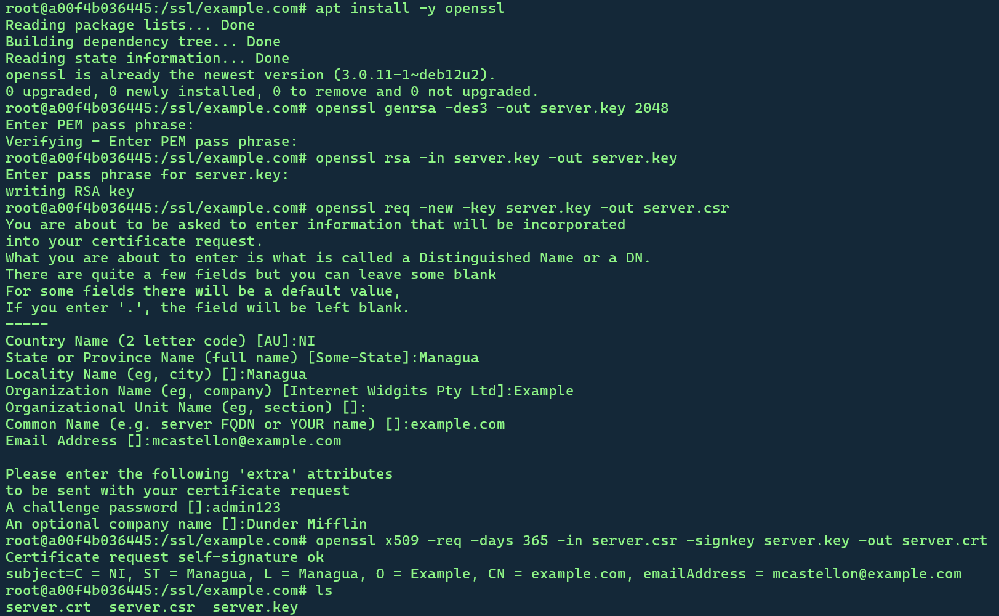

# Laboratorio : Implementación de Proxy (Parte I)
En este laboratorio implementarán un proxy en una red simple utilizando Docker. Se utilizará la imagen de Docker nginx-proxy, la cual se basa en el servidor web NGINX, para implementar un proxy inverso en la red. También utilizarán la imagen del servidor Tomcat para simular que se quiere acceder a un servicio web a través de NGINX.

## Introducción
¿Qué es un proxy?

Un proxy es un servidor intermediario que actúa como un intermediario entre un cliente y un servidor. Cuando un cliente solicita un recurso, como una página web, primero envía la solicitud al proxy. El proxy luego recupera el recurso del servidor y lo envía al cliente.

Los proxies se utilizan por varias razones, que incluyen:

- Mejora del rendimiento: El proxy puede almacenar en caché recursos populares, lo que puede reducir el tiempo que tarda el cliente en acceder a ellos.
- Seguridad: El proxy puede ocultar la dirección IP del cliente al servidor, lo que puede ayudar a proteger la privacidad del cliente.
- Filtrado de contenido: El proxy puede bloquear el acceso a contenido malicioso o no deseado.
- Control de acceso: El proxy puede controlar qué usuarios pueden acceder a qué recursos.

Ahora que se ha hablado brevemente sobre el concepto de proxy, es momento de discutir una variante: **El proxy inverso**.

Un proxy inverso es un tipo de proxy que se utiliza para publicar servicios web internos a Internet. Cuando un cliente externo solicita un recurso, el proxy inverso lo reenvía a un servidor web interno. El proxy inverso también puede proporcionar funciones de seguridad y rendimiento adicionales, como:

1. Terminación SSL: El proxy inverso puede terminar las conexiones SSL para los servidores web internos, lo que puede aliviar la carga de trabajo de los servidores web internos.
2. Balanceo de carga: El proxy inverso puede distribuir el tráfico entre varios servidores web internos.
3. Autenticación y autorización: El proxy inverso puede requerir a los usuarios que se autentiquen y autoricen antes de acceder a los recursos web internos.




## Paso 1: Crear una red de contenedores
Primero, vamos a crear una red de Docker para aislar nuestros contenedores:
`docker network create red-proxy`

### <span style="color: red;">Update</span>
Crea una segunda red: `docker network create red-web`. Esta red será exclusiva para los servidores web.

Investiga el rango de red que se ha asignado a las subredes creadas por el comando anterior.

## Paso 2: Ejecutar contenedores

`docker run -d --name lab-proxy --network red-proxy -p 8000:80 nginx:latest`
Este comando inicia el contenedor de nginx-proxy, lo conecta a la red "red-proxy" y expone el puerto 80.

En el navegador, escribe la dirección de localhost y el puerto para verificar que el proxy está funcionando correctamente. 

Es momento de levantar un servidor web. Para ello, ejecuta el comando `docker run -d --name web --network red-proxy -p 8080:8080 tomcat:9.0`. Es momento de descargar una aplicación de prueba para cargarla en el servidor Tomcat. Descarga el [archivo](https://tomcat.apache.org/tomcat-7.0-doc/appdev/sample/sample.war) en el equipo local.

######################################################################################
### <span style="color: red;">Update</span>

Crea los contenedores sin redirección de puerto, es decir, se debe suprimir el flag `-p 8080:8080` al momento de correr los contenedores. El comando actualizado sería `docker run -d --name web --cap-add=NET_ADMIN --cap-add=NET_RAW --network red-proxy tomcat:9.0`.

Ahora, utiliza el comando `docker cp` para copiar el archivo descargado a la ruta `/usr/local/tomcat/webapps`. Para confirmar que esta funcionando correctamente, puedes consultar la dirección localhost con el puerto asociado del servidor web, agregando al final el nombre de la aplicación (`/sample`).

### <span style="color: red;">Update</span>
Es necesario crear dos servidores web adicionales, de manera que tendremos una gran de servidores (pool) como parte del escenario. Esto es necesario para que la parte de balanceo de carga pueda funcionar. 


### <span style="color: red;">Update</span> 
Luego de haber creado los servidores (contenedores), conéctalos a la segunda red creada por medio del comando
`docker network connect nombre_red nombre_contenedor`, donde nombre_red corresponde a la segunda red y nombre_contenedor es el contenedor que queremos conectar a la red. Repite este paso para cada uno de los contenedores web creados como parte del escenario.

## Paso 3: Configurar el proxy
Copie desde el proxy el archivo `default.conf` en la ruta `/etc/nginx/conf.d/default.conf` hacia un destino en el equipo local (host). Abre el archivo `default.conf` para que puedas agregar la redirección del servidor web. Busca la sección `location` en el archivo para que puedas agregar lo siguiente:
```
location /sample {
    proxy_pass http://direccion_ip:8080/sample;
}
```

donde `direccion_ip` es la dirección del servidor web (investiga la dirección IP que se ha asignado al servidor).

Una vez que haya guardado los cambios en el archivo, copielo hacia el contenedor (proxy) a la misma ruta. Ejecute el comando `docker exec nombre_contenedor nginx -t` para validar la configuración y los cambios realizados el archivo. Si todo está bien, deberíamos ver un mensaje de éxito. Lo siguiente es refrescar los cambios realizados. Para lograrlo, ejecute el comando `docker exec nombre_contenedor nginx -s reload`.

# Parte 2
## Paso 4: Balanceo de carga
Crea dos servidores web más igual que en el paso #2 de manera que se tengan 3 servidores web en total. Consulta las direcciones IP asignadas a los servidores del rango de red.

Para implementar el balanceo de carga en el proxy, necesitamos definir un grupo de servidores con la directiva `upstream`, la cual debe estar ubicada dentro de un contexto `http`. Así, podemos agregar las siguientes líneas al archivo de configuración `default.conf`:

```
http {
  upstream backend {
    server direccion_ip:8080 weight=2;
    server direccion_ip:8080 weight=3;
    server direccion_ip:8080 weight=1;
  }

  server {
    location / {
      proxy_pass http://backend;
    }
  }

}
```
donde la `direccion_ip` corresponden a los servidores web implementados, y los pesos son tomados en cuenta con el algoritmo por defecto [Round Robin](https://en.wikipedia.org/wiki/Round-robin_scheduling).

En este ejemplo, hemos agregado tres servidores backend que corresponden a los servidores que hemos creado como parte del escenario. Hemos asignado pesos a cada servidor backend: 2, 3 y 1, respectivamente. Los pesos se utilizan para distribuir el tráfico entre los servidores backend. Un servidor backend con un peso mayor recibirá más tráfico que un servidor backend con un peso menor.

## Paso 5: Autenticación y Verificación
Para implementar autenticación y autorización en el proxy, podemos utilizar un módulo de autenticación de Nginx, como `auth_basic` o `auth_jwt`. Estos módulos permiten requerir a los usuarios que se autentiquen antes de acceder a los recursos backend. Una vez que un usuario se haya autenticado, podemos utilizar la información de autenticación para controlar qué recursos backend puede acceder. Sigue las instrucciones:
- Lo primero que debes hacer es asegurarte de instalar el paquete `apache2-utils`. 
- Luego, debes crear el archivo donde se guardarán las credenciales de los usuarios que accederán al proxy. Para ello, puedes ejecutar el comando `htpasswd -c /etc/nginx/.htpasswd usuario1`. Cuando presiones Enter, entonces te pedirá la contraseña y la repetición para guardarla en el archivo.
- Crea un segundo usuario utilizando el mismo comando (sin el flag `-c` porque el archivo ya existe).
- Verifica que el archivo contiene los nombres de usuario y las contraseñas (hashed) mostrando el contenido en consola.

### Configuración de la autenticación HTTP básica del proxy
Dentro de una ubicación que se necesita proteger, se especifica la directiva `auth_basic` y se especifica un nombre al área protegida con contraseña. El nombre del área se mostrará en la ventana de diálogo de `nombre de usuario/contraseña` cuando se soliciten las credenciales a los usuarios cuando estos quieran hacer solicitudes al proxy:

```

  location / {
    auth_basic "Restricted Area";
    auth_basic_user_file /etc/nginx/.htpasswd;
    proxy_pass http://backend;
  }

```

# Parte 3
## Paso 6: Implementación de terminación SSL y generación de certificados con OpenSSL en el Proxy
### 6.1 Terminación SSL:

La terminación SSL es el proceso de descifrar y manejar conexiones SSL/TLS en el servidor proxy. Esto permite al proxy proteger las comunicaciones entre el cliente y el servidor web interno.
Para implementar la terminación SSL en el proxy Nginx, podemos utilizar el módulo ssl. Este módulo permite al proxy configurar y administrar certificados SSL/TLS.

Pasos para implementar la terminación SSL:

1. Obtener un certificado SSL: Se puede obtener un certificado SSL de una autoridad de certificación (CA) comercial, pero para el laboratorio vamos a generar un certificado propio utilizando OpenSSL. Para generar un certificado:

- Asegúrate que openssl se encuentra instalado en el proxy. Utiliza el siguiente comando para instalarlo: `apt install -y openssl`
- Generar el certificado:
  -  Crear un directorio para el certificado SSL (en la ruta `/etc/nginx/`) y vé al directorio.
  -  Crear una llave privada
  -  Quitar el passphrase de la llave privada
  -  Crear una solicitud de firma de certificados (CSR)
  -  Utilizar el CSR para obtener una certificado auto firmado

A continuación, se muestra una captura de los comandos a ejecutar para los pasos anteriores:


2. Configurar el módulo SSL: Una vez que se tiene el certificado SSL, es necesario configurarlo en el archivo de configuración de Nginx. Para configurar el SSL, podemos agregar las siguientes líneas al archivo de configuración `nginx.conf`:

```
server {
  listen 443 ssl;
  server_name example.com www.example.com;

  ssl on;
  ssl_certificate /etc/nginx/ssl/example.com/server.crt;;
  ssl_certificate_key /etc/nginx/ssl/example.com/server.key;;

  location / {
    proxy_pass http://backend;
  }
}
```

En el bloque de código, hemos configurado el proxy para escuchar en el puerto 443 y usar SSL. También hemos especificado la ubicación de los archivos de certificado y clave SSL.

3. Reiniciar el servidor proxy: Una vez que haya configurado el módulo SSL, debe reiniciar el servidor proxy para que aplique los cambios. Para ello, ejecuta el siguiente comando: `docker exec nombre_contenedor nginx -s reload`.

# Parte 4
## Paso 7: Asegurando los servidores web
Actualmente, el sitio web alojado en los servidores backend puede ser accedido directamente por cualquiera que conozca su dirección IP. Esto puede evitarse configurando los servidores web de los backends para que sólo escuchen en la interfaz que se especifique. Para realizar esta configuración, es necesario hacer lo siguiente:
1. Configuración de la interfaz
- Edita el archivo `server.xml` que se encuentra en la ruta `/usr/local/tomcat/conf`.
- Dentro del archivo debes tener la etiqueta `Service`. Cambia esto de: `<Connector port="8080" protocol="HTTP/1.1"` a `<Connector address="direccion_IP" port="8080" protocol="HTTP/1.1"`, donde `direccion_IP` corresponde a la que se ha asignado en la red `red-proxy-web`. 
- Reinicia el servicio de Tomcat para hacer efectivo los cambios.
- Repite el mismo paso para los demás servidores web.
2. Restringir el acceso 
El siguiente paso para asegurar los servidores es restringir el acceso HTTP únicamente para la dirección IP dedicada para la conexión entre el balanceador y los servidores web. Esta dirección debe pertenecer a la red `red-proxy`.

Asegúrate de que [iptables](https://linux.die.net/man/8/iptables) esté instalado en los servidores web. iptables es una potente utilidad de línea de comandos en Linux que se utiliza para configurar políticas de seguridad de red y control de tráfico. Permite filtrar, manipular y enrutar paquetes de red, y puede utilizarse para tareas como cortafuegos, VPN y *traffic shaping*. Si no se encuentra instalado, puedes hacerlo por medio del comando `apt install -y iptables`.

Una vez que tengamos la utilidad en cada servidor, podemos verificar que las tablas estan vacías ejecutando el comando `iptables --list`. 

Para alcanzar el objetivo, la siguiente regla permite crear la restricción:
`iptables -I INPUT -m state --state NEW -p tcp --dport 80 ! -s direccion_IP -j DROP`.

Luego de crear la regla, podemos consultar la tabla para verificar que se ha creado correctamente.

## Paso 8: Verificación
Abre el navegador y escribe la dirección del proxy, pero esta vez accediendo a la aplicación que se ha cargado en el servidor web. Si todo funciona correctamente, deberías observar la página de la aplicación `sample` como parte de la consulta al servidor proxy.


